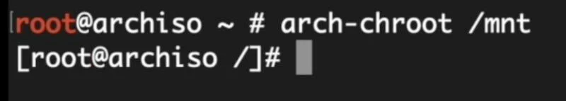

# Precision 5540
## Goals:
- Boot Windows and Arch

# Installation
### First steps:
```
pacman -Sy
pacman -S archlinux-keyring
```

### Partitioning the drive:
**512GB SSD**
- I had to reinstall Windows, and shrunk it to around 160GB because the partitions were messy.

After that, I had these partitions:
```bash
/dev/nvme0n1p1 - 100M EFI System
/dev/nvme0n1p2 - 16M Microsoft reserved
/dev/nvme0n1p3 - 160.9G Microsoft basic data
/dev/nvme0n1p4 - 509M Windows recovery environment
```
- I created the following Linux partitions:
```bash
/dev/nvme0n1p5 - 1G EFI System
/dev/nvme0n1p6 - 16G Linux swap
/dev/nvme0n1p7 - 200G Linux filesystem (/home)
/dev/nvme0n1p8 - 64G Linux filesystem (Arch root)
```
- Formatting the partitions:
```bash
mkfs.fat -F32 -n EFI /dev/nvme0n1p5
mkswap -L swap /dev/nvme0n1p6
mkfs.ext4 -L home /dev/nvme0n1p7
mkfs.ext4 -L Arch /dev/nvme0n1p8
```
- Mounting the partitions:
```bash
mount /dev/nvme0n1p8 /mnt
mkdir /mnt/boot /mnt/home
mount /dev/nvme0n1p5 /mnt/boot
mount /dev/nvme0n1p7 /mnt/home
swapon /dev/nvme0n1p6
```
### Installing the base system
```bash
pacstrap -i /mnt base base-devel linux-lts linux-firmware linux-lts-headers sudo intel-ucode nano git bluez bluez-utils networkmanager brightnessctl
```

### Generate File System Table (FSTAB)
```bash
genfstab -U /mnt >> /mnt/etc/fstab
```

### CHROOT To Newley Installed system
```bash
arch-chroot /mnt
```


Change root password with `passwd` then add a new user with this command:
```bash
useradd -m -g users -G wheel,storage,video,audio -s /bin/bash USER_NAME
passwd USER_NAME
```

Edit sudo file:
`EDITOR=nano visudo`
Uncomment `%wheel ALL=(ALL:ALL) ALL` and save the changes with CTRL + O and CTRL + X to Exit.

### Setup Timezone/Region
```bash
ln -sf /usr/share/zoneinfo/Pacific/Auckland /etc/localtime
timedatectl set-ntp true
hwclock --systohc
```

### Setup System Language
```bash
nano /etc/locale.gen
```
Uncomment `en_US.UTF-8 UTF-8`

Generate locale file:
```bash
locale-gen
echo "LANG=en_US.UTF-8" >> /etc/locale.conf
```

### Setup Host Name
```bash
echo "Precision5540" >> /etc/hostname
```

### Add boot entry to bios
Install the required services:
```bash
sudo pacman -S efibootmgr
```

Get the PARTUUID for `/` (`/dev/nvme0n1p8`):
```bash
lsblk -o NAME,FSTYPE,UUID,PARTUUID
```

Create an entry:
```bash
sudo efibootmgr --create --disk /dev/nvme0n1 --part 5 \
  --label "Arch Linux" \
  --loader '\vmlinuz-linux-lts' \
  --unicode "root=PARTUUID=YOUR-ROOT-PARTUUID rw intel_iommu=on iommu=pt initrd=\intel-ucode.img initrd=\initramfs-linux-lts.img" \
  --verbose
```
Replace `YOUR-ROOT-PARTUUID` with the partuuid of your root partition, and replace `--part 5` with the number of the boot partition (in this case its /dev/nvme0n1p`5`)

### Enable services
```bash
systemctl enable bluetooth
systemctl enable NetworkManager
```

### Exit
Exit chroot by typing `exit` and unmount the partitions with `umount -lR /mnt`. Reboot with `reboot` and boot into Arch.

## Arch Setup:

### Disabe power button
1. Edit `/etc/systemd/logind.conf`
   ```bash
   sudo nano /etc/systemd/logind.conf
   ```
3. Uncomment `HandlePowerKey` and set it to ignore
   ```bash
   HandlePowerKey=ignore
   ```

### Audio
```bash
sudo pacman -S pipewire pipewire-pulse pavucontrol
sudo reboot
```

### Flatpak:
```bash
sudo pacman -S flatpak
sudo reboot
```

### Yay
```bash
mkdir -p ~/repos/AUR/
cd ~/repos/AUR
git clone https://aur.archlinux.org/yay.git
cd yay
makepkg -si
```

### NVIDIA Drivers
```bash
sudo pacman -S --needed linux-lts-headers
sudo pacman -S --needed nvidia-dkms nvidia-utils nvidia-settings nvidia-prime
sudo mkinitcpio -P
sudo reboot
```

### lm_sensors
```bash
sudo pacman -S lm_sensors
sudo sensors-detect
```

### powertop
```bash
sudo pacman -S powertop
sudo powertop
```

### Portal
1. Install `xdg`
```bash
sudo pacman -S xdg-utils xdg-desktop-portal-wlr xdg-desktop-portal xdg-desktop-portal-gtk
```

2. Create a file called `~/.config/mimeapps.list`
```conf
[Default Applications]
text/plain=code.desktop
inode/directory=pcmanfm.desktop
image/png=imv.desktop
application/pdf=firefox.desktop
x-scheme-handler/http=firefox.desktop
x-scheme-handler/https=firefox.desktop
```
[View full file](https://raw.githubusercontent.com/UndercoverComputing/linux-configs/refs/heads/main/Dell/Arch/.config/mimeapps.list)

### Wine
Install Wine:
```bash
sudo pacman -Syu wine
```

### SMB:
Install `gvfs-smb`
```bash
sudo pacman -S gvfs-smb
```

In PCMan, open `smb://xxx.xxx.xxx.xxx/`

### Windows VM
[Instruction link](https://github.com/UndercoverComputing/linux-configs/blob/main/Dell/Arch/Windows-VM.md)

### Other applications
```bash
sudo pacman -S firefox man
yay -S brave-bin google-chrome modrinth-app-bin visual-studio-code-bin
```

### Modrinth
1. Install FUSE: `sudo pacman -S fuse`
2. Edit the Modrinth desktop entry `/usr/share/applications/modrinth-app.desktop` and add `prime-run ` before `modrinth-app` in the `Exec` line.
